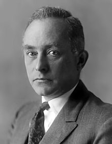

<table class="infobox biography vcard">
<tbody>
<tr>
<th colspan="2">

Max Born

</th>
</tr>
<tr>
<td colspan="2">

Born circa 1930&ndash;1940

</td>
</tr>
<tr>
<th scope="row">Born</th>
<td>11 December 1882 

<a title="Wrocław" href="https://en.wikipedia.org/wiki/Wroc%C5%82aw">Breslau</a>,&nbsp;<a title="German Empire" href="https://en.wikipedia.org/wiki/German_Empire">German Empire</a>

</td>
</tr>
<tr>
<th scope="row">Died</th>
<td>5 January 1970&nbsp;(aged&nbsp;87) 

<a title="G&ouml;ttingen" href="https://en.wikipedia.org/wiki/G%C3%B6ttingen">G&ouml;ttingen</a>,&nbsp;<a title="West Germany" href="https://en.wikipedia.org/wiki/West_Germany">West Germany</a>

</td>
</tr>
<tr>
<th scope="row">Resting place</th>
<td class="label"><a title="Stadtfriedhof (G&ouml;ttingen)" href="https://en.wikipedia.org/wiki/Stadtfriedhof_(G%C3%B6ttingen)">Stadtfriedhof</a>, G&ouml;ttingen,&nbsp;<a title="Lower Saxony" href="https://en.wikipedia.org/wiki/Lower_Saxony">Lower Saxony</a>,&nbsp;<a title="West Germany" href="https://en.wikipedia.org/wiki/West_Germany">West Germany</a></td>
</tr>
<tr>
<th scope="row">Citizenship</th>
<td class="category">German, British</td>
</tr>
<tr>
<th scope="row">Alma&nbsp;mater</th>
<td><a title="University of G&ouml;ttingen" href="https://en.wikipedia.org/wiki/University_of_G%C3%B6ttingen">University of G&ouml;ttingen</a></td>
</tr>
<tr>
<th scope="row">Known&nbsp;for</th>
<td><a title="Born&ndash;Haber cycle" href="https://en.wikipedia.org/wiki/Born%E2%80%93Haber_cycle">Born&ndash;Haber cycle</a> <a title="Born rigidity" href="https://en.wikipedia.org/wiki/Born_rigidity">Born rigidity</a> <a title="Born coordinates" href="https://en.wikipedia.org/wiki/Born_coordinates">Born coordinates</a> <a title="Born approximation" href="https://en.wikipedia.org/wiki/Born_approximation">Born approximation</a> <a title="Born series" href="https://en.wikipedia.org/wiki/Born_series">Born series</a> <a class="mw-redirect" title="Born probability" href="https://en.wikipedia.org/wiki/Born_probability">Born probability</a> <a class="mw-redirect" title="Born&ndash;Infeld theory" href="https://en.wikipedia.org/wiki/Born%E2%80%93Infeld_theory">Born&ndash;Infeld theory</a> <a title="Born&ndash;Oppenheimer approximation" href="https://en.wikipedia.org/wiki/Born%E2%80%93Oppenheimer_approximation">Born&ndash;Oppenheimer approximation</a> <a title="Born rule" href="https://en.wikipedia.org/wiki/Born_rule">Born rule</a> <a title="Born&ndash;Land&eacute; equation" href="https://en.wikipedia.org/wiki/Born%E2%80%93Land%C3%A9_equation">Born&ndash;Land&eacute; equation</a> <a title="Born&ndash;Huang approximation" href="https://en.wikipedia.org/wiki/Born%E2%80%93Huang_approximation">Born&ndash;Huang approximation</a> <a title="Born&ndash;von Karman boundary condition" href="https://en.wikipedia.org/wiki/Born%E2%80%93von_Karman_boundary_condition">Born&ndash;von Karman boundary condition</a> <a title="Born equation" href="https://en.wikipedia.org/wiki/Born_equation">Born equation</a> <a title="Adiabatic theorem" href="https://en.wikipedia.org/wiki/Adiabatic_theorem">Adiabatic theorem</a> <a title="Canonical commutation relation" href="https://en.wikipedia.org/wiki/Canonical_commutation_relation">Canonical commutation relation</a></td>
</tr>
<tr>
<th scope="row">Spouse(s)</th>
<td>Hedwig (Hedi) Ehrenberg (1891&ndash;1972) (m. 1913&ndash;1970; his death)</td>
</tr>
<tr>
<th scope="row">Children</th>
<td>3, including&nbsp;<a title="Gustav Victor Rudolf Born" href="https://en.wikipedia.org/wiki/Gustav_Victor_Rudolf_Born">Gustav Victor Rudolf Born</a></td>
</tr>
<tr>
<th scope="row">Awards</th>
<td><a title="Nobel Prize in Physics" href="https://en.wikipedia.org/wiki/Nobel_Prize_in_Physics">Nobel Prize in Physics</a>&nbsp;(1954) <a title="Hughes Medal" href="https://en.wikipedia.org/wiki/Hughes_Medal">Hughes Medal</a>&nbsp;(1950) <a title="Max Planck Medal" href="https://en.wikipedia.org/wiki/Max_Planck_Medal">Max Planck Medal</a>&nbsp;(1948) <a title="Fellow of the Royal Society" href="https://en.wikipedia.org/wiki/Fellow_of_the_Royal_Society">Fellow of the Royal Society</a>&nbsp;(1939)</td>
</tr>
<tr>
<td colspan="2"><strong>Scientific career</strong></td>
</tr>
<tr>
<th scope="row">Fields</th>
<td class="category"><a title="Theoretical physics" href="https://en.wikipedia.org/wiki/Theoretical_physics">Theoretical physics</a></td>
</tr>
<tr>
<th scope="row">Institutions</th>
<td><a class="mw-redirect" title="Johann Wolfgang Goethe University of Frankfurt am Main" href="https://en.wikipedia.org/wiki/Johann_Wolfgang_Goethe_University_of_Frankfurt_am_Main">University of Frankfurt am Main</a> <a title="University of G&ouml;ttingen" href="https://en.wikipedia.org/wiki/University_of_G%C3%B6ttingen">University of G&ouml;ttingen</a> <a title="University of Edinburgh" href="https://en.wikipedia.org/wiki/University_of_Edinburgh">University of Edinburgh</a> <a title="University of Cambridge" href="https://en.wikipedia.org/wiki/University_of_Cambridge">University of Cambridge</a></td>
</tr>
<tr>
<th scope="row"><a title="Thesis" href="https://en.wikipedia.org/wiki/Thesis">Thesis</a></th>
<td><em>Untersuchungen &uuml;ber die Stabilit&auml;t der elastischen Linie in Ebene und Raum unter verschiedenen Grenzbedingungen ("</em><strong>Investigations on the stability of the elastic line in plane and space under different boundary conditions</strong><em>")</em>&nbsp;(1906)</td>
</tr>
<tr>
<th scope="row"><a title="Doctoral advisor" href="https://en.wikipedia.org/wiki/Doctoral_advisor">Doctoral advisor</a></th>
<td><a title="Carl Runge" href="https://en.wikipedia.org/wiki/Carl_Runge">Carl Runge</a></td>
</tr>
<tr>
<th scope="row">Other&nbsp;academic advisors</th>
<td>

<ul>
<li><a title="Woldemar Voigt" href="https://en.wikipedia.org/wiki/Woldemar_Voigt">Woldemar Voigt</a></li>
<li><a title="Karl Schwarzschild" href="https://en.wikipedia.org/wiki/Karl_Schwarzschild">Karl Schwarzschild</a></li>
<li><a title="Joseph Larmor" href="https://en.wikipedia.org/wiki/Joseph_Larmor">Joseph Larmor</a></li>
<li><a title="J. J. Thomson" href="https://en.wikipedia.org/wiki/J._J._Thomson">J. J. Thomson</a></li>
</ul>

</td>
</tr>
<tr>
<th scope="row">Doctoral students</th>
<td>

<ul>
<li><a title="Mary Bradburn" href="https://en.wikipedia.org/wiki/Mary_Bradburn">Mary Bradburn</a></li>
<li><a title="Cheng Kaijia" href="https://en.wikipedia.org/wiki/Cheng_Kaijia">Kaijia Cheng</a></li>
<li><a title="Max Delbr&uuml;ck" href="https://en.wikipedia.org/wiki/Max_Delbr%C3%BCck">Max Delbr&uuml;ck</a></li>
<li><a class="mw-redirect" title="Walter Elsasser" href="https://en.wikipedia.org/wiki/Walter_Elsasser">Walter Elsasser</a></li>
<li><a title="Siegfried Fl&uuml;gge" href="https://en.wikipedia.org/wiki/Siegfried_Fl%C3%BCgge">Siegfried Fl&uuml;gge</a></li>
<li><a class="mw-redirect" title="Maria Goeppert-Mayer" href="https://en.wikipedia.org/wiki/Maria_Goeppert-Mayer">Maria Goeppert-Mayer</a></li>
<li><a title="Herbert S. Green" href="https://en.wikipedia.org/wiki/Herbert_S._Green">Herbert S. Green</a></li>
<li><a title="Friedrich Hund" href="https://en.wikipedia.org/wiki/Friedrich_Hund">Friedrich Hund</a></li>
<li><a title="Pascual Jordan" href="https://en.wikipedia.org/wiki/Pascual_Jordan">Pascual Jordan</a></li>
<li><a title="Edgar Krahn" href="https://en.wikipedia.org/wiki/Edgar_Krahn">Edgar Krahn</a></li>
<li><a title="J. Robert Oppenheimer" href="https://en.wikipedia.org/wiki/J._Robert_Oppenheimer">J. Robert Oppenheimer</a></li>
<li><a title="Lothar Wolfgang Nordheim" href="https://en.wikipedia.org/wiki/Lothar_Wolfgang_Nordheim">Lothar Wolfgang Nordheim</a></li>
<li><a title="Peng Huanwu" href="https://en.wikipedia.org/wiki/Peng_Huanwu">Huanwu Peng</a></li>
<li><a title="Maurice Pryce" href="https://en.wikipedia.org/wiki/Maurice_Pryce">Maurice Pryce</a></li>
<li><a title="Bertha Swirles" href="https://en.wikipedia.org/wiki/Bertha_Swirles">Bertha Swirles</a></li>
<li><a class="mw-redirect" title="Victor Frederick Weisskopf" href="https://en.wikipedia.org/wiki/Victor_Frederick_Weisskopf">Victor Frederick Weisskopf</a></li>
<li><a title="Yang Liming" href="https://en.wikipedia.org/wiki/Yang_Liming">Liming Yang</a></li>
</ul>

</td>
</tr>
<tr>
<th scope="row">Other&nbsp;notable students</th>
<td>

<ul>
<li><a title="Enrico Fermi" href="https://en.wikipedia.org/wiki/Enrico_Fermi">Enrico Fermi</a></li>
<li><a title="Huang Kun" href="https://en.wikipedia.org/wiki/Huang_Kun">Huang Kun</a></li>
<li><a title="Emil Wolf" href="https://en.wikipedia.org/wiki/Emil_Wolf">Emil Wolf</a></li>
</ul>

</td>
</tr>
<tr>
<th colspan="2">Signature</th>
</tr>
<tr>
<td colspan="2"></td>
</tr>
</tbody>
</table>
 

<strong>Max Born</strong>&nbsp;(11 December 1882&nbsp;&ndash; 5 January 1970) was a German&nbsp;<a title="Physicist" href="https://en.wikipedia.org/wiki/Physicist">physicist</a>&nbsp;and&nbsp;<a title="Mathematician" href="https://en.wikipedia.org/wiki/Mathematician">mathematician</a>&nbsp;who was instrumental in the development of&nbsp;<a title="Quantum mechanics" href="https://en.wikipedia.org/wiki/Quantum_mechanics">quantum mechanics</a>. He also made contributions to&nbsp;<a title="Solid-state physics" href="https://en.wikipedia.org/wiki/Solid-state_physics">solid-state physics</a>&nbsp;and&nbsp;<a title="Optics" href="https://en.wikipedia.org/wiki/Optics">optics</a>&nbsp;and supervised the work of a number of notable physicists in the 1920s and 1930s. Born won the 1954&nbsp;<a title="Nobel Prize in Physics" href="https://en.wikipedia.org/wiki/Nobel_Prize_in_Physics">Nobel Prize in Physics</a>&nbsp;for his "fundamental research in quantum mechanics, especially in the statistical interpretation of the&nbsp;<a title="Wave function" href="https://en.wikipedia.org/wiki/Wave_function">wave function</a>".

Born entered the&nbsp;<a title="University of G&ouml;ttingen" href="https://en.wikipedia.org/wiki/University_of_G%C3%B6ttingen">University of G&ouml;ttingen</a>&nbsp;in 1904, where he met the three renowned mathematicians&nbsp;<a title="Felix Klein" href="https://en.wikipedia.org/wiki/Felix_Klein">Felix Klein</a>,&nbsp;<a title="David Hilbert" href="https://en.wikipedia.org/wiki/David_Hilbert">David Hilbert</a>, and&nbsp;<a title="Hermann Minkowski" href="https://en.wikipedia.org/wiki/Hermann_Minkowski">Hermann Minkowski</a>. He wrote his&nbsp;<a class="mw-redirect" title="Ph.D." href="https://en.wikipedia.org/wiki/Ph.D.">Ph.D.</a>&nbsp;thesis on the subject of "Stability of Elastica in a&nbsp;<a title="Plane (geometry)" href="https://en.wikipedia.org/wiki/Plane_(geometry)">Plane</a>&nbsp;and&nbsp;<a title="Space" href="https://en.wikipedia.org/wiki/Space">Space</a>", winning the University's Philosophy Faculty Prize. In 1905, he began researching&nbsp;<a title="Special relativity" href="https://en.wikipedia.org/wiki/Special_relativity">special relativity</a>&nbsp;with Minkowski, and subsequently wrote his&nbsp;<a title="Habilitation" href="https://en.wikipedia.org/wiki/Habilitation">habilitation</a>&nbsp;thesis on the&nbsp;<a class="mw-redirect" title="Thomson model" href="https://en.wikipedia.org/wiki/Thomson_model">Thomson model</a>&nbsp;of the atom. A chance meeting with&nbsp;<a title="Fritz Haber" href="https://en.wikipedia.org/wiki/Fritz_Haber">Fritz Haber</a>&nbsp;in Berlin in 1918 led to discussion of how an&nbsp;<a title="Ionic compound" href="https://en.wikipedia.org/wiki/Ionic_compound">ionic compound</a>&nbsp;is formed when a&nbsp;<a title="Metal" href="https://en.wikipedia.org/wiki/Metal">metal</a>&nbsp;reacts with a&nbsp;<a title="Halogen" href="https://en.wikipedia.org/wiki/Halogen">halogen</a>, which is today known as the&nbsp;<a title="Born&ndash;Haber cycle" href="https://en.wikipedia.org/wiki/Born%E2%80%93Haber_cycle">Born&ndash;Haber cycle</a>.

In&nbsp;<a title="World War I" href="https://en.wikipedia.org/wiki/World_War_I">World War I</a>, after originally being placed as a radio operator, he was moved to research duties regarding&nbsp;<a class="mw-redirect" title="Sound ranging" href="https://en.wikipedia.org/wiki/Sound_ranging">sound ranging</a>&nbsp;due to his specialist knowledge. In 1921, Born returned to G&ouml;ttingen, arranging another chair for his long-time friend and colleague&nbsp;<a title="James Franck" href="https://en.wikipedia.org/wiki/James_Franck">James Franck</a>. Under Born, G&ouml;ttingen became one of the world's foremost centres for physics. In 1925, Born and&nbsp;<a title="Werner Heisenberg" href="https://en.wikipedia.org/wiki/Werner_Heisenberg">Werner Heisenberg</a>&nbsp;formulated the&nbsp;<a title="Matrix mechanics" href="https://en.wikipedia.org/wiki/Matrix_mechanics">matrix mechanics</a>&nbsp;representation of quantum mechanics. The following year, he formulated the now-standard interpretation of the&nbsp;<a title="Probability amplitude" href="https://en.wikipedia.org/wiki/Probability_amplitude">probability density function</a>&nbsp;for &psi;*&psi; in the&nbsp;<a title="Schr&ouml;dinger equation" href="https://en.wikipedia.org/wiki/Schr%C3%B6dinger_equation">Schr&ouml;dinger equation</a>, for which he was awarded the Nobel Prize in 1954. His influence extended far beyond his own research.&nbsp;<a title="Max Delbr&uuml;ck" href="https://en.wikipedia.org/wiki/Max_Delbr%C3%BCck">Max Delbr&uuml;ck</a>,&nbsp;<a title="Siegfried Fl&uuml;gge" href="https://en.wikipedia.org/wiki/Siegfried_Fl%C3%BCgge">Siegfried Fl&uuml;gge</a>,&nbsp;<a title="Friedrich Hund" href="https://en.wikipedia.org/wiki/Friedrich_Hund">Friedrich Hund</a>,&nbsp;<a title="Pascual Jordan" href="https://en.wikipedia.org/wiki/Pascual_Jordan">Pascual Jordan</a>,&nbsp;<a class="mw-redirect" title="Maria Goeppert-Mayer" href="https://en.wikipedia.org/wiki/Maria_Goeppert-Mayer">Maria Goeppert-Mayer</a>,&nbsp;<a title="Lothar Wolfgang Nordheim" href="https://en.wikipedia.org/wiki/Lothar_Wolfgang_Nordheim">Lothar Wolfgang Nordheim</a>,&nbsp;<a class="mw-redirect" title="Robert Oppenheimer" href="https://en.wikipedia.org/wiki/Robert_Oppenheimer">Robert Oppenheimer</a>, and&nbsp;<a title="Victor Weisskopf" href="https://en.wikipedia.org/wiki/Victor_Weisskopf">Victor Weisskopf</a>&nbsp;all received their Ph.D. degrees under Born at G&ouml;ttingen, and his assistants included&nbsp;<a title="Enrico Fermi" href="https://en.wikipedia.org/wiki/Enrico_Fermi">Enrico Fermi</a>, Werner Heisenberg,&nbsp;<a title="Gerhard Herzberg" href="https://en.wikipedia.org/wiki/Gerhard_Herzberg">Gerhard Herzberg</a>, Friedrich Hund, Pascual Jordan,&nbsp;<a title="Wolfgang Pauli" href="https://en.wikipedia.org/wiki/Wolfgang_Pauli">Wolfgang Pauli</a>,&nbsp;<a title="L&eacute;on Rosenfeld" href="https://en.wikipedia.org/wiki/L%C3%A9on_Rosenfeld">L&eacute;on Rosenfeld</a>,&nbsp;<a title="Edward Teller" href="https://en.wikipedia.org/wiki/Edward_Teller">Edward Teller</a>, and&nbsp;<a title="Eugene Wigner" href="https://en.wikipedia.org/wiki/Eugene_Wigner">Eugene Wigner</a>.

In January 1933, the&nbsp;<a title="Nazi Party" href="https://en.wikipedia.org/wiki/Nazi_Party">Nazi Party</a>&nbsp;came to power in Germany, and Born, who was&nbsp;<a class="mw-redirect" title="Jewish" href="https://en.wikipedia.org/wiki/Jewish">Jewish</a>, was suspended from his professorship at the University of G&ouml;ttingen. He emigrated to the United Kingdom, where he took a job at&nbsp;<a title="St John's College, Cambridge" href="https://en.wikipedia.org/wiki/St_John%27s_College,_Cambridge">St John's College, Cambridge</a>, and wrote a popular science book,&nbsp;<em>The Restless Universe</em>, as well as&nbsp;<em>Atomic Physics</em>, which soon became a standard textbook. In October 1936, he became the Tait Professor of&nbsp;<a title="Natural philosophy" href="https://en.wikipedia.org/wiki/Natural_philosophy">Natural Philosophy</a>&nbsp;at the&nbsp;<a class="mw-redirect" title="Edinburgh University" href="https://en.wikipedia.org/wiki/Edinburgh_University">University of Edinburgh</a>, where, working with German-born assistants E. Walter Kellermann and&nbsp;<a title="Klaus Fuchs" href="https://en.wikipedia.org/wiki/Klaus_Fuchs">Klaus Fuchs</a>, he continued his research into physics. Born became a naturalised&nbsp;<a title="British subject" href="https://en.wikipedia.org/wiki/British_subject">British subject</a>&nbsp;on 31 August 1939, one day before&nbsp;<a title="World War II" href="https://en.wikipedia.org/wiki/World_War_II">World War II</a>&nbsp;broke out in Europe. He remained in Edinburgh until 1952. He retired to&nbsp;<a title="Bad Pyrmont" href="https://en.wikipedia.org/wiki/Bad_Pyrmont">Bad Pyrmont</a>, in&nbsp;<a title="West Germany" href="https://en.wikipedia.org/wiki/West_Germany">West Germany</a>, and died in hospital in G&ouml;ttingen on 5 January 1970.

 

<strong> Publications: </strong>

<ul>

 <li><a target="_blank" href="https://github.com/manjunath5496/Max-Born-Publications/blob/master/tst(111).pdf" style="text-decoration:none;">Einstein's theory of relativity</a></li>
                            
 <li><a target="_blank" href="https://github.com/manjunath5496/Max-Born-Publications/blob/master/tst(112).pdf" style="text-decoration:none;">Physics in My Generation</a></li>

<li><a target="_blank" href="https://github.com/manjunath5496/Max-Born-Publications/blob/master/tst(113).pdf" style="text-decoration:none;">The Born Einstein Letters</a></li>
 <li><a target="_blank" href="https://github.com/manjunath5496/Max-Born-Publications/blob/master/tst(114).pdf" style="text-decoration:none;">The Mechanics Of The Atom</a></li>                              

 <li><a target="_blank" href="https://github.com/manjunath5496/Max-Born-Publications/blob/master/tst(115).pdf" style="text-decoration:none;">The Statistical Interpretation of Quantum Mechanics [Nobel Lecture]</a></li>
                            
 <li><a target="_blank" href="https://github.com/manjunath5496/Max-Born-Publications/blob/master/tst(116).pdf" style="text-decoration:none;">Quantum Mechanics of Collision Processes</a></li>                              

 <li><a target="_blank" href="https://github.com/manjunath5496/Max-Born-Publications/blob/master/tst(117).pdf" style="text-decoration:none;">Natural Philosophy of Cause and Chance</a></li>

</ul>

 
